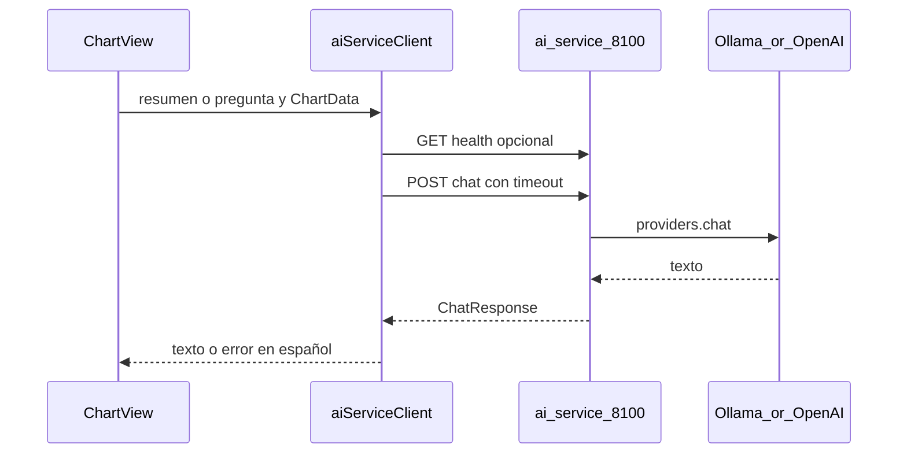

> Estado: ACTIVO | Creado: 2026-03-26 | Última revisión: 2026-03-30

# Plan: integración Carta Astral con ai-service

Copia canónica en el repo del plan acordado (la versión en `.cursor/plans/` no se versiona). Actualizar **Última revisión** al modificar este archivo.

**Modelo:** Carta Astral es una **app** (Electron) que **consume** **ai-service** en `D:\services\` (puerto 8100); no se añade un servicio HTTP nuevo en el monorepo de services.

## Objetivo

Integrar la app Electron con **ai-service** (`localhost:8100`) mediante un cliente HTTP con **timeout explícito**, un flujo de **resumen asistido** de la carta actual (y opcionalmente una pregunta corta), documentación y ecosistema alineados con las reglas (mensajes de sistema fijados en código, sin fallbacks silenciosos).

## Hoja de ruta IA (cuatro capas)

Mapa corto para **priorizar valor** con la IA sin duplicar aquí el contrato HTTP completo. Orden sugerido de lectura y trabajo:

| Capa | En qué consiste | Detalle |
|------|-----------------|---------|
| **1. Producto / app** | Prompts fijos en código, UX del asistente, nuevos usos sobre la carta | Resto de **este plan** y rutas citadas (`ChartView`, cliente IA, tests) |
| **2. Operación** | Timeouts del cliente, arranque de ai-service, health, errores en español | Secciones *Contexto técnico* y *Arranque automático* aquí; `ensure-ai-service.ts`, `ai-service-client.ts` |
| **3. Gateway / contrato** | HTTP, límites, timeouts en servidor, CORS, consumidores, backlog técnico compartido | `D:\services\docs\PLAN_AI_SERVICE_GATEWAY.md` (incl. sección **I. Backlog y próximos pasos**) |
| **4. Meta / documentación** | Docs y paquete de contexto alineados con el monorepo | Tras editar `docs/` relevantes en `D:\services`, ejecutar `powershell -ExecutionPolicy Bypass -File D:\services\scripts\claude-context\sync-services.ps1`. **No** editar a mano `docs-claude/`. |

**Nota:** Cifras concretas (p. ej. timeouts en segundos) deben contrastarse con el plan gateway y con `main.py` / `providers.py` (sección 0 de ese documento).

## Tareas

| Tarea | Prioridad | Esfuerzo | Dependencias |
|-------|-----------|----------|--------------|
| Cliente `ai-service-client.ts` + `chartDataToPromptContext` + timeout y errores en español | Alta | Medio | Ninguna |
| Tests Vitest (fetch mockeado: health, chat 200, 503, timeout; asserts sobre URL/cuerpo) | Alta | Medio | Cliente |
| Componente `ChartAiAssistant` + integración en `ChartView` (UX carga/error, a11y) | Alta | Medio | Cliente |
| `.env.example` + README (Ollama, ai-service, `VITE_AI_SERVICE_URL`, auto-arranque) | Media | Bajo | Ninguna |
| Proceso **main** Electron: comprobar `/health` y lanzar `ai-service/start.bat` (o `start.sh`) si no responde — `ensure-ai-service.ts`, `load-local-env.ts`, tests en `src/__tests__/main/` | Media | Medio | Ninguna |
| Actualizar `D:\services\docs\projects\CARTA_ASTRAL.md` + ejecutar `sync-services.ps1` tras cambios en la ficha | Media | Bajo | Ninguna |
| Cierre: checklist auditoría reglas (sección más abajo) | Alta | Bajo | Todo lo anterior |

## Riesgos y regresiones

- **ai-service u Ollama apagados:** la carta debe seguir funcionando; solo el bloque IA muestra error claro.
- **Auto-arranque:** si `SERVICES_ROOT` o la ruta por defecto no existen, o el script falla, la consola del proceso main debe mostrar el error; la ventana de la app no debe bloquearse esperando el servicio.
- **Latencia alta:** timeout acotado (p. ej. 45–60 s) y estado de carga visible.
- **Datos personales en el prompt:** por defecto flujo local (Ollama); documentar si en el futuro se usa OpenAI.
- **Regresión en tests existentes:** ejecutar `npm test -- --run` antes de cerrar (0 failed, 0 skipped, 0 warnings).

## Aprobación

No implementar hasta **OK explícito** del responsable del proyecto (regla de fases del ecosistema).

## Referencias

- **Índice cuatro capas (prioridad y enlaces):** sección [Hoja de ruta IA (cuatro capas)](#hoja-de-ruta-ia-cuatro-capas) más arriba.
- **App vs services (dónde implementar qué):** sección *Dónde trabajar: repo de la app vs `D:\services`* más abajo.
- **Plan gateway (contrato HTTP, timeouts, consumidores, seguridad, auditoría de reglas):** `D:\services\docs\PLAN_AI_SERVICE_GATEWAY.md`
- Contrato: `POST /chat`, `GET /health` en `D:\services\ai-service\main.py`
- Arranque asistido: `src/main/ensure-ai-service.ts`, carga `.env` en main: `src/main/load-local-env.ts`
- Vista carta: `src/renderer/components/ChartView.tsx`, `App.tsx`
- Ficha ecosistema: `D:\services\docs\projects\CARTA_ASTRAL.md`
- Reglas: `.cursor/rules/global-rules.mdc` (fuente `D:\services\docs\REGLAS_DESARROLLO.md`)

---

## Contexto técnico

- **Contrato:** `POST /chat` con `{ messages: [{role, content}], system_prompt?: string }` y respuesta `{ response, model, provider }`. CORS en ai-service permite orígenes amplios; el **renderer** puede usar `fetch` como en `src/renderer/lib/utils/geocoding.ts`.
- **Punto de UI:** `ChartView` cuando `currentView === 'chart'` en `App.tsx`.

## Alcance MVP

1. Botón **Generar resumen con IA** con contexto estructurado desde `ChartData` (`birthData`, `planets`, `ascendant`, `midheaven`, `aspects` si existen) y **system prompt fijo en código** (español, divulgativo, no contradecir cifras, sin médico/legal/financiero).
2. Opcional: campo **Pregunta sobre esta carta** (misma llamada `POST /chat`).
3. Si `GET /health` falla o `POST /chat` devuelve 503/502/timeout: mensaje en español y guía para arrancar ai-service/Ollama. Sin `catch` vacío.

## Arranque automático de ai-service (Electron main)

Al iniciar la app, el **proceso principal** (`src/main/main.ts`):

1. Carga variables desde `.env` en la raíz del proyecto (`load-local-env.ts`) sin sobrescribir las ya definidas en el sistema.
2. Si `AUTO_START_AI_SERVICE` no es `0` / `false` / `off` / `no`, hace `GET` a `{AI_SERVICE_URL}/health` (timeout corto, ~2,5 s). Si responde OK, no hace nada más.
3. Si no responde, resuelve la ruta al script de arranque:
   - **Windows:** `SERVICES_ROOT` o por defecto `D:\services` → `ai-service\start.bat`.
   - **macOS / Linux:** obligatorio `SERVICES_ROOT` → `ai-service/start.sh` (vía `bash`).
4. Lanza el script en **proceso independiente** (ventana minimizada en Windows) y **reintenta** health hasta ~60 s; el resultado se registra en la **consola** del proceso main (éxito o mensaje de error explícito).

**Desactivar:** `AUTO_START_AI_SERVICE=0` en `.env` o en el entorno.

**Nota:** Si `ai-service` no tiene `.env`, su `start.bat` puede pausar pidiendo configuración; es el comportamiento propio del servicio, no de Carta Astral.

## Implementación (resumen)

| Área | Acción |
|------|--------|
| Config | `VITE_AI_SERVICE_URL` y `AI_SERVICE_URL` default `http://127.0.0.1:8100`; `SERVICES_ROOT`; `AUTO_START_AI_SERVICE` en `.env.example` y README |
| Main | `ensureAiServiceRunning()` al `app.whenReady()` (no bloquea la UI); Windows: `start.bat` minimizado; Unix: `bash` + `start.sh` si `SERVICES_ROOT` está definido |
| Cliente | `src/renderer/lib/ai/ai-service-client.ts`: `AbortSignal.timeout` o `AbortController`, `GET /health`, `POST /chat`, tipos alineados con FastAPI |
| Contexto | Función pura `chartDataToPromptContext(chart)` solo con datos ya calculados |
| UI | `ChartAiAssistant.tsx` en `ChartView` con `CollapsibleSection`, `aria-label`, resultado scrollable |
| Tests | Vitest con mocks que validen comportamiento real del cliente |
| Ecosistema | `CARTA_ASTRAL.md` + `D:\services\scripts\claude-context\sync-services.ps1` |

## Asistente IA: alcance actual y otras pantallas (valoración de producto)

Documentación de **qué hace hoy** el bloque IA, **dónde está cableado**, **dónde no**, y **dónde tendría sentido extenderlo** (prioridades y notas técnicas). La implementación sigue siendo opcional por vista; esta sección es la referencia para futuros `feat:`.

### Comportamiento actual (MVP implementado)

| Aspecto | Detalle |
|---------|---------|
| **Ubicación UI** | Solo en la vista de **una carta natal**: componente `ChartAiAssistant` dentro de [`ChartView.tsx`](../src/renderer/components/ChartView.tsx), visible en todos los modos de esa vista (detallada / gamificada / aspectos). |
| **Entrada de datos** | Siempre se envía el contexto JSON generado por [`chartDataToPromptContext`](../src/renderer/lib/ai/chart-prompt-context.ts) a partir de `ChartData` (nacimiento, ascendente, MC, planetas, aspectos). |
| **Sin pregunta opcional** | El mensaje de usuario pide explícitamente un **resumen divulgativo** coherente con esos datos (`requestChartSummary` en [`ai-service-client.ts`](../src/renderer/lib/ai/ai-service-client.ts)). |
| **Con pregunta opcional** | Misma llamada `POST /chat`; el cuerpo incluye `Pregunta del usuario: …` para que el modelo responda **acotado a la carta** (no es un chat libre general). |
| **System prompt** | Fijo en código (`AI_CHART_SYSTEM_PROMPT`): español, ceñirse al JSON (planetas con signo/casa exactos, aspectos solo del array, no mezclar cuerpos); refuerzo breve en el mensaje de usuario (`USER_CHART_VERIFICATION_TAIL`); sin médico/legal/financiero, sin certezas absolutas sobre personalidad/futuro. |
| **Backend** | Un único endpoint de app: **ai-service** `POST /chat` (y errores gestionados como en el plan). |

### Pantallas donde **no** hay asistente IA hoy

| Vista en `App.tsx` | Componente principal | Notas |
|--------------------|----------------------|--------|
| `compare` | [`CompareView.tsx`](../src/renderer/components/CompareView.tsx) | Sin `ChartAiAssistant` ni llamadas a `ai-service`. |
| `transits` | [`TodayDashboard`](../src/renderer/components/Transits/TodayDashboard.tsx) | Tránsitos del día / calendario; sin bloque IA. |
| `compatibility-matrix` | [`CompatibilityMatrix.tsx`](../src/renderer/components/CompatibilityMatrix.tsx) | Matriz numérica; sin IA. |
| `transit-reminders` | [`TransitReminders.tsx`](../src/renderer/components/Transits/TransitReminders.tsx) | Recordatorios; sin IA. |
| `home` | [`HomePage.tsx`](../src/renderer/components/HomePage.tsx) | Hub; sin contexto de una carta concreta en pantalla. |
| Formularios (`add-person`, `edit-person`, `edit-my-chart`) | `AddPersonForm` | No hay carta calculada que interpretar. |

La vista `chart` (demo, mi carta o carta de otra persona cargada con `currentChartData`) **sí** incluye el asistente, porque todas pasan por `ChartView`.

### Valoración: dónde extender el asistente (prioridad sugerida)

Orden pensado para **alineación con la intención del usuario** (interpretar resultados ya calculados) y para **evitar redundancia** (no repetir el mismo bloque en tres sitios sin criterio).

| Prioridad | Pantalla | Por qué encaja | Matices |
|-----------|----------|----------------|---------|
| **Alta** | **Comparación de cartas** (`CompareView`) | Es donde se busca **significado de la relación** (sinastría), no solo tablas. IA útil: resumen de la dinámica entre dos mapas, tensiones/armonías, pregunta opcional (“¿dónde nos complementamos?”). | Hace falta **nuevo serializador de contexto** (dos `ChartData`, nombres, y opcionalmente aspectos intercartas si se exponen en esa vista). **No** reutilizar solo `chartDataToPromptContext` de una carta. |
| **Alta** | **Tránsitos** (`TodayDashboard`) | Valor distinto al natal: **“qué hace esto hoy / esta semana”**. IA útil: resumen del día o respuesta sobre tránsitos listados. | El prompt debe incluir **tránsitos calculados** (fechas, orbes, planetas, etc.), no únicamente el JSON natal. Requiere función pura nueva que serialice lo que ya muestra el dashboard. |
| **Media** | **Matriz de compatibilidad** | Vista sobre todo **exploración numérica**; muchos usuarios pasan a **Comparar** para el detalle. | Un bloque IA “lectura general de la matriz” puede **solaparse** con IA en `CompareView`. Valorar **una sola** narrativa profunda (p. ej. solo comparación) antes de duplicar. |
| **Media** | **Recordatorios de tránsitos** | Podría **priorizar o agrupar** en lenguaje natural una lista larga de eventos. | Menos imprescindible que el dashboard de “hoy”; depende del uso real de esa pantalla. |
| **Baja** | **Home**, listados | Demasiado genérico; no hay un resultado astrológico único en foco. | Mejor mantener el asistente **por contexto concreto** (natal / pareja / momento). |

### Principio de diseño

- **Un bloque canónico por tipo de contexto:** natal (hecho), **relación** (dos cartas), **momento** (tránsitos). Evitar tres copias del mismo texto genérico en subvistas de la misma carta si ya existe en `ChartView`.
- **Sin cambiar el contrato de ai-service** para estas extensiones: siguen siendo mensajes + `system_prompt`; puede añadirse un `system_prompt` específico por modo (comparación / tránsitos) en código.

### Checklist antes de implementar una nueva ubicación

- [ ] Definir **función pura** de contexto (tests con datos de ejemplo).
- [ ] Definir **system prompt** (o constante) acorde al modo (mismas líneas rojas: no inventar datos, no médico/legal, etc.).
- [ ] Reutilizar `ChartAiAssistant` con props (`title`, `buildContext`, `systemPrompt`) **o** componente hermano que comparta UX (carga/error/a11y).
- [ ] `npm test -- --run` y prueba manual con ai-service + proveedor.

### Dónde trabajar: repo de la **app** vs repo **`D:\services`** (ai-service)

Referencia para **no olvidar** la frontera entre proyectos y evitar buscar “dónde poner la IA” en el sitio equivocado.

#### División de responsabilidades

| Capa | Repo / carpeta | Qué incluye |
|------|----------------|-------------|
| **Gateway LLM genérico** | `D:\services\ai-service` | HTTP `GET /health`, `POST /chat`; habla con Ollama/OpenAI; **no** conoce cartas, `ChartView` ni Electron. |
| **Producto astrología + UX** | `D:\projects\carta-astral-app` | Cliente HTTP (`ai-service-client.ts`), serialización de contexto (`chart-prompt-context.ts` y futuros), **system prompts y texto del mensaje de usuario**, componentes UI (`ChartAiAssistant`), decisión de **en qué pantalla** va el bloque. |

La **lógica de negocio interpretativa** (qué datos mandar, qué prohibir al modelo, en qué vista aparece el botón) vive en la **app**. **ai-service** solo ejecuta el chat con el cuerpo que le envíe el cliente.

#### Qué valorar en cada repo (enfoque complementario)

| Pregunta | Dónde mirar primero |
|----------|---------------------|
| ¿En qué **pantalla** ponemos el asistente (comparación, tránsitos, etc.)? | **App** — `App.tsx`, vistas, este plan (*Asistente IA: alcance actual y otras pantallas*). |
| ¿Qué **JSON o texto** va en `messages` / `system_prompt`? | **App** — código en `src/renderer/lib/ai/` y prompts en TypeScript. |
| ¿Hace falta un **nuevo contrato** HTTP, límites de payload, streaming o auth en el servidor? | **`D:\services\ai-service`** (+ documentar consumidores en `D:\services\docs\` si aplica). |
| ¿**Varias apps** del ecosistema necesitan el mismo flujo especializado (mismo prompt + misma estructura)? | Entonces puede debatirse subir parte a **services** (endpoint o plantilla compartida); para Carta Astral hoy **no es necesario**: basta `POST /chat` genérico. |

#### Idea errónea frecuente

Abrir solo el monorepo **`D:\services`** para decidir **“dónde poner la IA”** en el sentido de **UX** (comparación, tránsitos, etc.) **no sustituye** el trabajo en la app: **ai-service no tiene pantallas** ni flujo de sinastría. En services tiene sentido revisar **operación del servicio**, **contrato** y **consumidores**; la **valoración de ubicaciones** del asistente sigue documentada **en este plan** (repo Carta Astral).

#### Resumen en una frase

**Services = puerta al modelo; app = qué contar y dónde mostrarlo.**

---

## Fuera de alcance (fases futuras)

- Auth hacia ai-service; historial multi-turno persistente; sustituir todas las interpretaciones por IA; logging-service (plan aparte: `docs/PLAN_LOGGING_SERVICE.md`).
- **Extensiones de UI** valoradas en la sección *Asistente IA: alcance actual y otras pantallas* (comparación, tránsitos, etc.): documentadas aquí; **implementación pendiente** salvo el MVP en `ChartView`.

## Auditoría — reglas repo y Cursor (obligatoria antes de cerrar)

**Fuentes de verdad:**

| Ámbito | Ubicación |
|--------|-----------|
| Reglas ecosistema (67) | `d:\projects\carta-astral-app\.cursor\rules\global-rules.mdc` → `D:\services\docs\REGLAS_DESARROLLO.md` |
| Cursor en este repo | Solo `global-rules.mdc` |
| Docs en `D:\services` | `D:\services\.cursor\rules\documentation-sync.mdc`, `ecosystem-context.mdc` |
| Plan versionado | Este archivo `docs/PLAN_AI_SERVICE.md` |

**Checklist por sector (aplicable a esta feature):**

1. **Calidad y testing** — `npm test -- --run`: 0 failed, 0 skipped, 0 warnings. Mocks que verifiquen **URL** (`/health`, `/chat`), **cuerpo** (mensajes, `system_prompt` si aplica) y **timeout**, no mocks vacíos 🐛. Si no hay prueba E2E con ai-service + proveedor real: **pedir prueba manual** antes de cerrar.
2. **Errores y HTTP** — Timeout explícito en **cada** llamada a ai-service. Sin `catch` vacío; errores de red y 502/503 visibles para el usuario en **español** en la UI del bloque IA (sin bloquear el resto de la app).
3. **TypeScript** — Tipos estrictos para request/response (`ChatRequest` / `ChatResponse` alineados con FastAPI); sin `any` innecesario.
4. **IA y producto (⭐⭐⭐)** — **System prompt y límites del rol fijados en código**; el modelo elabora sobre datos ya calculados; no sustituye la lógica de negocio ni posiciones. Ningún mensaje crítico al usuario depende solo del LLM sin control del código.
5. **UX / frontend** — Estados **carga, error y vacío** en el bloque IA; **accesibilidad** (`aria-label`, teclado donde aplique); **responsive** coherente con `ChartView`.
6. **Seguridad** — No subir `.env`; actualizar `.env.example` con `VITE_AI_SERVICE_URL`. No **loguear** el prompt completo con datos personales en producción; no hardcodear API keys.
7. **Variables de entorno** — Documentar en el mismo commit en que se lea la variable en el cliente.
8. **API REST (consumidor)** — Interpretar errores FastAPI (`detail`); manejar 503/502/422 sin asumir 200 con error en body.
9. **Commits** — Nunca `--no-verify`; separar commits cuando haya `feat:` + `docs:` ecosistema.
10. **Documentación `D:\services`** — Tras `CARTA_ASTRAL.md`: `sync-services.ps1`; no editar a mano `docs-claude/`.
11. **Arquitectura** — Consumir **ai-service** existente; no embeber motor LLM propio en la app.
12. **Comunicación** — Cierre con PARA QUÉ / POR QUÉ; pendientes explícitos (p. ej. prueba manual con Ollama).

**Poco aplicable:** convenciones Python/Pydantic en servicios no tocados; `start.bat` de servicios Python; otros `.mdc` de `D:\services` salvo que se editen esas carpetas.

**Entregable de auditoría:** revisar esta lista contra el diff y anotar si hubo verificación manual con ai-service (:8100).

## Orden de trabajo

1. Cliente + contexto + tests del cliente  
2. UI + `ChartView`  
3. README + `.env.example` + `CARTA_ASTRAL.md` + `sync-services.ps1`  
4. `npm test -- --run`  
5. Checklist de auditoría  
