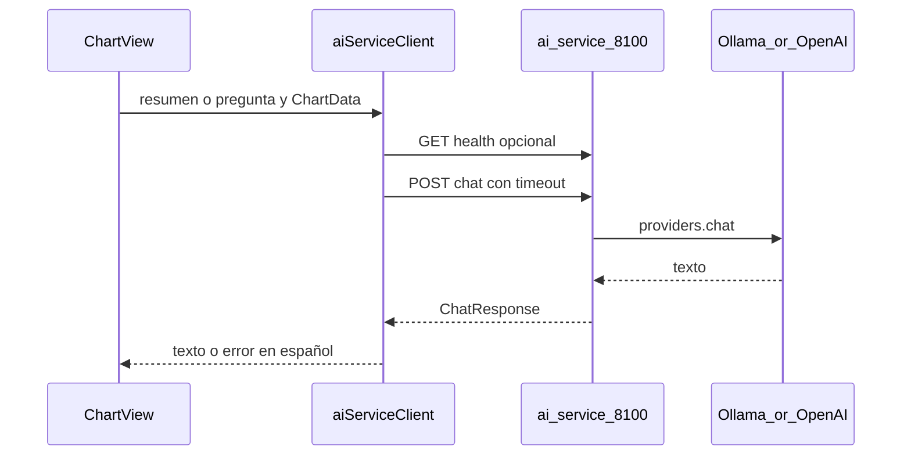

> Estado: ACTIVO | Creado: 2026-03-26 | Última revisión: 2026-03-26

# Plan: integración Carta Astral con ai-service

Copia canónica en el repo del plan acordado (la versión en `.cursor/plans/` no se versiona). Actualizar **Última revisión** al modificar este archivo.

## Objetivo

Integrar la app Electron con **ai-service** (`localhost:8100`) mediante un cliente HTTP con **timeout explícito**, un flujo de **resumen asistido** de la carta actual (y opcionalmente una pregunta corta), documentación y ecosistema alineados con las reglas (mensajes de sistema fijados en código, sin fallbacks silenciosos).

## Tareas

| Tarea | Prioridad | Esfuerzo | Dependencias |
|-------|-----------|----------|--------------|
| Cliente `ai-service-client.ts` + `chartDataToPromptContext` + timeout y errores en español | Alta | Medio | Ninguna |
| Tests Vitest (fetch mockeado: health, chat 200, 503, timeout; asserts sobre URL/cuerpo) | Alta | Medio | Cliente |
| Componente `ChartAiAssistant` + integración en `ChartView` (UX carga/error, a11y) | Alta | Medio | Cliente |
| `.env.example` + README (Ollama, ai-service, `VITE_AI_SERVICE_URL`) | Media | Bajo | Ninguna |
| Actualizar `D:\services\docs\projects\CARTA_ASTRAL.md` + `sync-services.ps1` | Media | Bajo | Ninguna |
| Cierre: checklist auditoría reglas (sección más abajo) | Alta | Bajo | Todo lo anterior |

## Riesgos y regresiones

- **ai-service u Ollama apagados:** la carta debe seguir funcionando; solo el bloque IA muestra error claro.
- **Latencia alta:** timeout acotado (p. ej. 45–60 s) y estado de carga visible.
- **Datos personales en el prompt:** por defecto flujo local (Ollama); documentar si en el futuro se usa OpenAI.
- **Regresión en tests existentes:** ejecutar `npm test -- --run` antes de cerrar (0 failed, 0 skipped, 0 warnings).

## Aprobación

No implementar hasta **OK explícito** del responsable del proyecto (regla de fases del ecosistema).

## Referencias

- Contrato: `POST /chat`, `GET /health` en `D:\services\ai-service\main.py`
- Vista carta: `src/renderer/components/ChartView.tsx`, `App.tsx`
- Ficha ecosistema: `D:\services\docs\projects\CARTA_ASTRAL.md`
- Reglas: `.cursor/rules/global-rules.mdc` (fuente `D:\services\docs\REGLAS_DESARROLLO.md`)

---

## Contexto técnico

- **Contrato:** `POST /chat` con `{ messages: [{role, content}], system_prompt?: string }` y respuesta `{ response, model, provider }`. CORS en ai-service permite orígenes amplios; el **renderer** puede usar `fetch` como en `src/renderer/lib/utils/geocoding.ts`.
- **Punto de UI:** `ChartView` cuando `currentView === 'chart'` en `App.tsx`.

## Alcance MVP

1. Botón **Generar resumen con IA** con contexto estructurado desde `ChartData` (`birthData`, `planets`, `ascendant`, `midheaven`, `aspects` si existen) y **system prompt fijo en código** (español, divulgativo, no contradecir cifras, sin médico/legal/financiero).
2. Opcional: campo **Pregunta sobre esta carta** (misma llamada `POST /chat`).
3. Si `GET /health` falla o `POST /chat` devuelve 503/502/timeout: mensaje en español y guía para arrancar ai-service/Ollama. Sin `catch` vacío.

## Implementación (resumen)

| Área | Acción |
|------|--------|
| Config | `VITE_AI_SERVICE_URL` default `http://127.0.0.1:8100` en `.env.example` y README |
| Cliente | `src/renderer/lib/ai/ai-service-client.ts`: `AbortSignal.timeout` o `AbortController`, `GET /health`, `POST /chat`, tipos alineados con FastAPI |
| Contexto | Función pura `chartDataToPromptContext(chart)` solo con datos ya calculados |
| UI | `ChartAiAssistant.tsx` en `ChartView` con `CollapsibleSection`, `aria-label`, resultado scrollable |
| Tests | Vitest con mocks que validen comportamiento real del cliente |
| Ecosistema | `CARTA_ASTRAL.md` + `D:\services\scripts\claude-context\sync-services.ps1` |

## Fuera de alcance (fases futuras)

- Auth hacia ai-service; historial multi-turno persistente; sustituir todas las interpretaciones por IA; logging-service (opcional después).

## Auditoría — reglas repo y Cursor (obligatoria antes de cerrar)

**Fuentes:**

| Ámbito | Ubicación |
|--------|-----------|
| Reglas ecosistema (67) | `d:\projects\carta-astral-app\.cursor\rules\global-rules.mdc` → fuente `D:\services\docs\REGLAS_DESARROLLO.md` |
| Cursor en este repo | Solo `global-rules.mdc` |
| Docs en `D:\services` | `D:\services\.cursor\rules\documentation-sync.mdc`, `ecosystem-context.mdc` |

**Checklist:** tests 0/0/0; mocks no vacíos; timeout explícito; errores visibles en ES; TypeScript strict sin `any` innecesario; system prompt en código; UX carga/error/vacío y a11y; `.env.example` actualizado; no loguear PII del prompt; commits sin `--no-verify`; sync `docs-claude` por script; consumir ai-service sin duplicar motor LLM; cierre PARA QUÉ / POR QUÉ y pendientes explícitos.

**Poco aplicable:** Python/Pydantic; `start.bat` de servicios Python; otros `.mdc` de services no tocados.

## Orden de trabajo

1. Cliente + contexto + tests del cliente  
2. UI + `ChartView`  
3. README + `.env.example` + `CARTA_ASTRAL.md` + `sync-services.ps1`  
4. `npm test -- --run`  
5. Checklist de auditoría  
