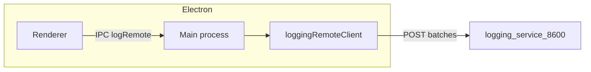

> Estado: ACTIVO | Creado: 2026-03-26 | Última revisión: 2026-03-26

# Plan: integración Carta Astral con logging-service

Copia canónica en el repo del plan acordado (la versión en `.cursor/plans/` no se versiona). Actualizar **Última revisión** al modificar este archivo.

## Objetivo

Que la app **opcionalmente** envíe eventos de log a **logging-service** (`localhost:8600`) con el **mismo contrato JSON** que usa `D:\services\shared\logging_handler.py`, desde el **proceso main** de Electron (cola + lotes + timeout), sin bloquear la UI ni enviar datos personales completos en los mensajes.

## Tareas

| Tarea | Prioridad | Esfuerzo | Dependencias |
|-------|-----------|----------|--------------|
| Definir carga de `LOGGING_SERVICE_URL` en proceso **main** (electron-vite / env) | Alta | Bajo | Ninguna |
| Módulo `src/main/logging-remote.ts`: cola, flush, `POST /logs`, timeout, `service: carta-astral-app` | Alta | Medio | Env main |
| IPC `logRemote` en preload + registro en `main.ts` (allowlist de niveles) | Alta | Medio | Cliente batch |
| Cablear ERROR/WARN en flujos críticos (cálculo, ficheros) sin PII en `message`/`extra` | Alta | Medio | IPC |
| Tests: formateador `LogEntry` + `fetch` mockeado (URL, body `entries`, timeout) | Alta | Medio | Cliente |
| `.env.example` + README (puerto 8600, arranque logging-service) | Media | Bajo | Ninguna |
| `D:\services\docs\projects\CARTA_ASTRAL.md` + opcional línea en `docs/services/logging-service.md` consumidores | Media | Bajo | Ninguna |
| `sync-services.ps1` tras tocar `CARTA_ASTRAL.md` | Media | Bajo | Doc ecosistema |
| Cierre: checklist auditoría (sección más abajo) | Alta | Bajo | Todo lo anterior |

## Riesgos y regresiones

- **logging-service apagado:** no debe fallar guardado ni cálculo; descartar lote o log a stderr como el handler Python.
- **Sobrecarga:** limitar INFO; batch; evitar logs en hot paths por píxel.
- **`.env` en main:** confirmar cómo electron-vite inyecta variables al proceso main; documentar alternativa (variable de sistema).
- **Regresión tests:** `npm test -- --run` → 0 failed, 0 skipped, 0 warnings.

## Aprobación

No implementar hasta **OK explícito** del responsable del proyecto (regla de fases del ecosistema).

## Referencias

- Esquema: `D:\services\logging-service\schemas.py` (`LogEntry`, `LogBatchRequest`)
- Handler referencia: `D:\services\shared\logging_handler.py` (timeout 5 s, lotes)
- Doc canónica: `D:\services\docs\services\logging-service.md`
- Ficha proyecto: `D:\services\docs\projects\CARTA_ASTRAL.md`
- Reglas: `.cursor/rules/global-rules.mdc` → `D:\services\docs\REGLAS_DESARROLLO.md`
- Plan hermano: `docs/PLAN_AI_SERVICE.md`

---

## Contexto técnico

- **Ingesta:** `POST /logs` con `{"entries": [ ... ]}` (máx. 500 entradas por lote).
- **Campos** alineados con `LogEntry`: `timestamp` ISO 8601, `service`, `level`, `logger`, `message`, `request_id?`, `extra?`.

## Alcance MVP

1. Nombre de servicio fijo p. ej. **`carta-astral-app`**.
2. **Main** recibe logs vía IPC; renderer no hace `fetch` a :8600.
3. **`LOGGING_SERVICE_URL`** opcional; si falta o es inválida, sin cliente remoto.
4. Niveles mínimos: **ERROR** y **WARNING**; **INFO** solo eventos puntuos (arranque / “remote logging activo”).
5. **Prohibido** en `message`/`extra`: nombre completo, fecha/lugar de nacimiento, coordenadas; usar textos genéricos o ids no reversibles.
6. Fallo de red: no romper la app; en dev puede registrarse en consola de main una línea.

## Implementación (resumen)

| Área | Acción |
|------|--------|
| Cliente TS | `logging-remote.ts`: cola, flush por tamaño/tiempo, `AbortSignal.timeout`, JSON `LogBatchRequest` |
| IPC | Preload + `ipcMain` canal acotado; validar `level` contra enum permitido |
| Renderer | Llamar solo API expuesta; errores ya capturados |
| Config | `LOGGING_SERVICE_URL` en `.env.example` y README |
| Tests | Lógica pura importable en Vitest; asserts sobre cuerpo del POST |
| Ecosistema | `CARTA_ASTRAL.md`; opcional actualizar lista consumidores en `logging-service.md` |

## Fuera de alcance (fases futuras)

- Sustituir todo logging local por remoto.
- `request_id` distribuido multi-pantalla sin diseño previo.
- Enviar logs sensibles o trazas completas de datos de nacimiento.

## Auditoría — reglas repo y Cursor (obligatoria antes de cerrar)

**Fuentes de verdad:**

| Ámbito | Ubicación |
|--------|-----------|
| Reglas ecosistema (67) | `d:\projects\carta-astral-app\.cursor\rules\global-rules.mdc` → `D:\services\docs\REGLAS_DESARROLLO.md` |
| Cursor en este repo | Solo `global-rules.mdc` |
| Docs en `D:\services` | `D:\services\.cursor\rules\documentation-sync.mdc`, `ecosystem-context.mdc` |
| Plan versionado | Este archivo `docs/PLAN_LOGGING_SERVICE.md` |

**Checklist por sector (aplicable a esta feature):**

1. **Calidad y testing** — `npm test -- --run`: 0 failed, 0 skipped, 0 warnings. Mocks que verifiquen **URL `/logs`**, **cuerpo `entries`**, **timeout**, no mocks vacíos 🐛. Si no hay prueba E2E con logging-service real: **pedir prueba manual** (GET `/logs?service=carta-astral-app`) antes de cerrar.
2. **Errores y HTTP** — Timeout explícito en **cada** `POST` (no default infinito). Sin `catch` vacío en el renderer por culpa del logging remoto. Fallo de envío: app usable; trazas técnicas sin tragar errores críticos del negocio.
3. **TypeScript** — Tipos estrictos para entradas IPC y para filas `LogEntry`; sin `any` innecesario.
4. **IA y producto** — No aplica LLM; no sustituir mensajes de usuario visibles solo por logs remotos.
5. **UX** — El usuario final no debe ver bloqueos por logging caído; opcional indicador “diagnóstico” solo en ajustes avanzados (fuera MVP si no se pide).
6. **Seguridad** — No subir `.env`; actualizar `.env.example` con `LOGGING_SERVICE_URL`. No volcar PII en mensajes ni en `extra`; no loguear tokens.
7. **Variables de entorno** — Documentar en el mismo commit que se lea la variable en main.
8. **API REST (consumidor)** — Manejar respuestas no OK de FastAPI (`detail` si aplica); no asumir 200 con error en body.
9. **Commits** — Nunca `--no-verify`; un commit = una cosa cuando sea razonable (p. ej. separar `feat:` de `docs:` ecosistema).
10. **Documentación `D:\services`** — Tras `CARTA_ASTRAL.md`: `sync-services.ps1`; no editar a mano `docs-claude/`.
11. **Arquitectura** — Reutilizar contrato de logging-service; no duplicar servidor de logs en la app.
12. **Comunicación** — Cierre con PARA QUÉ / POR QUÉ; pendientes explícitos (p. ej. prueba manual).

**Poco aplicable:** reglas específicas de servicios Python no tocados; otros `.mdc` de `D:\services` salvo que se editen esas carpetas.

**Entregable de auditoría:** revisar esta lista contra el diff y anotar si hubo verificación manual con :8600.

## Orden de trabajo

1. Investigación env en **main**  
2. Cliente de lotes + tipos `LogEntry`  
3. IPC + cableado ERROR/WARN  
4. Tests + README + `.env.example`  
5. `CARTA_ASTRAL.md` + `sync-services.ps1` + opcional `logging-service.md`  
6. Checklist de auditoría  
